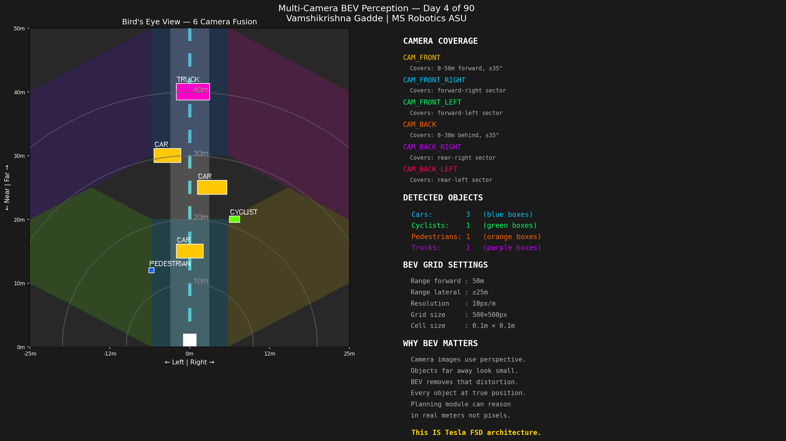
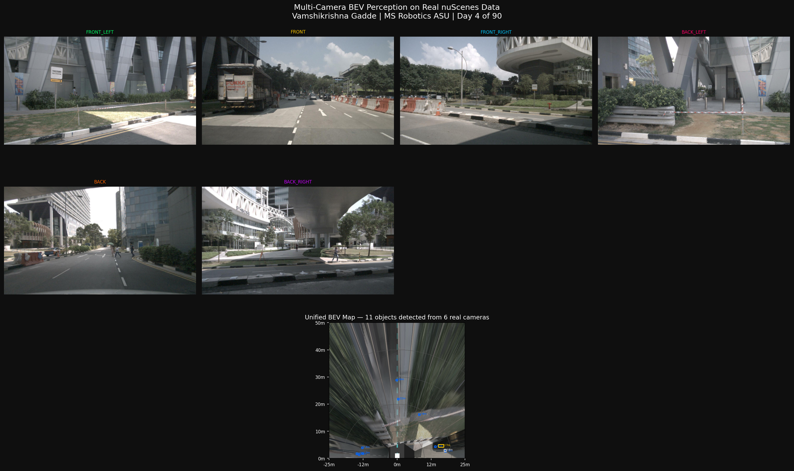
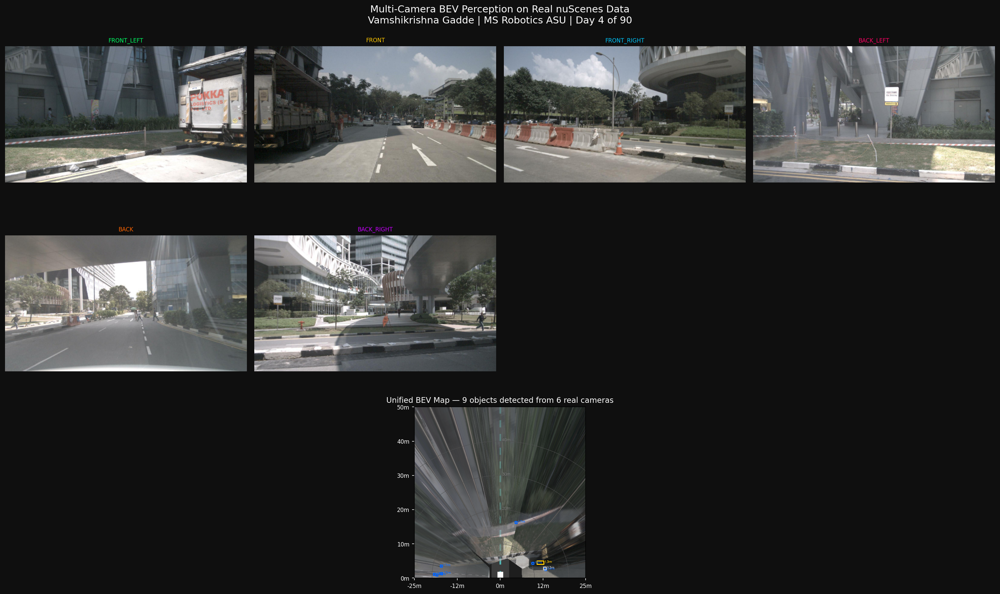
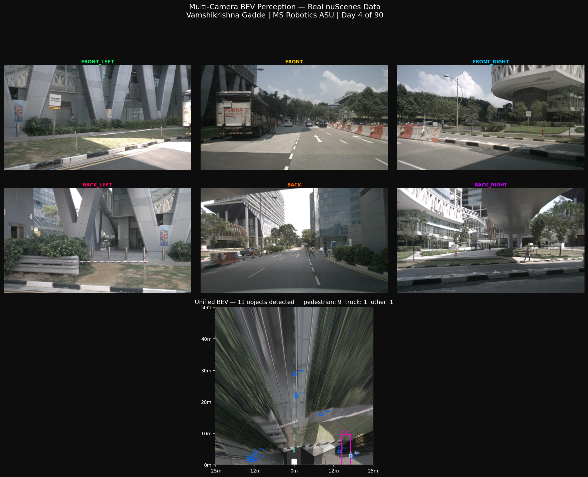
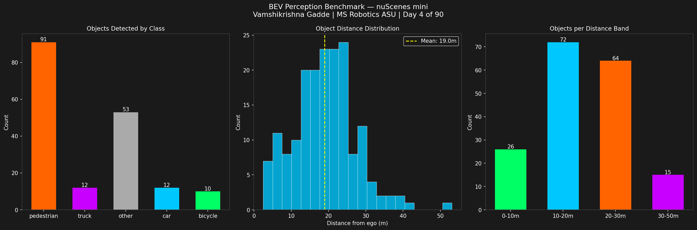

# Day 4: Multi-Camera Bird's Eye View Perception

**Vamshikrishna Gadde | MS Robotics and Autonomous Systems, ASU, Dec 2026**

---

## The Problem

A self-driving car has 6 cameras. Each sees a different slice of the world. None of them gives you real distances. The planning module cannot reason in pixels. It needs to know "obstacle is 15 meters ahead, 2 meters left", not "obstacle is at pixel (823, 412)."

The solution is Bird's Eye View perception. Project all 6 cameras onto a flat top-down grid. Every object appears at its true position in real meters. All 6 views unified into one map. This is exactly what Tesla FSD does. I built it from scratch on real nuScenes sensor data.

---

## How It Works

```
6 camera images (1600x900 each)
    |
    v
Inverse Perspective Mapping
    For each BEV grid cell, compute real-world ground position
    Transform into each camera's coordinate frame
    Sample color from camera image at that location
    Assume z=0 (flat ground plane)
    |
    v
6-camera canvas blend
    Front covers forward region
    4 corner cameras cover sides
    Back camera covers rear
    Overlap zones blended 75/25 (new/existing)
    |
    v
nuScenes 3D annotations
    Transform world coordinates to ego frame
    Draw bounding boxes with class and distance labels
    |
    v
Unified BEV map
    50m forward x 50m wide
    Full 360 degree coverage
    Real metric scale
```

---

## Demo



---

## Real nuScenes Data: Singapore Streets







---

## Benchmark: 20 Real nuScenes Frames



```
Samples processed:    20 real driving frames
Total objects:        178 in BEV range
Average per frame:    8.9 objects
BEV coverage:         50m forward x 50m wide
```

Per-class breakdown:

| Class | Count | Avg Distance | Range |
|-------|-------|-------------|-------|
| Pedestrians | 91 | 19.5m | 2.5-53.1m |
| Other | 53 | 19.4m | 2.7-30.2m |
| Trucks | 12 | 13.2m | 4.5-25.2m |
| Cars | 12 | 18.2m | 14.0-24.8m |
| Bicycles | 10 | 20.0m | 12.2-29.4m |

Distance distribution:

```
0-10m     26 objects   14.6%
10-20m    72 objects   40.4%   critical zone
20-30m    64 objects   36.0%
30-50m    15 objects    8.4%
```

76.4% of all objects appear in the 10-30m band. This is the critical zone for urban driving, close enough to matter, far enough that reaction time is limited.

---

## Three Findings

**Pedestrians dominate at 51%.** 91 of 178 objects are pedestrians, reflecting the Singapore urban environment. Pedestrian width (0.5-0.8m) at 20m occupies very few BEV grid cells, making false negatives more likely than with larger vehicles.

**IPM accuracy degrades with distance.** IPM assumes all objects are on a flat ground plane. At 10m the error from elevated objects is small. At 40m the same angular error produces a much larger position error in BEV. The same geometric limitation measured in Day 2 for stereo depth applies here.

**6 cameras give full 360 coverage with no LiDAR.** A cyclist cutting in from the left at 8 meters appears correctly in BEV even if it never enters the front camera's field of view. Day 8 adds LiDAR to replace the ground plane assumption with real 3D measurements.

---

## Dataset

```
Source:       nuScenes mini v1.0, Motional
Location:     Singapore and Boston
Cameras:      6 per frame, 1600x900 pixels each
Annotations:  18,538 3D object labels
Scenes:       10 real driving sequences
Samples:      404 synchronized frames
```

Camera positions: CAM_FRONT, CAM_FRONT_RIGHT, CAM_FRONT_LEFT, CAM_BACK, CAM_BACK_RIGHT, CAM_BACK_LEFT

---

## What I Learned

IPM is a ground plane assumption, not a depth measurement. When you trace each BEV grid cell back through the camera transform you realize the algorithm assumes z=0 for every world point. A 3 meter tall truck at 15 meters has its roof projecting 2-3 meters behind its actual position in BEV space. This systematic error is invisible until you implement the math yourself.

Camera extrinsics matter as much as intrinsics. The four corner cameras on nuScenes are angled roughly 55 degrees from forward. Getting the rotation quaternion to rotation matrix conversion correct was the most debugging-intensive part. A wrong rotation produces projections that overlap incorrectly or leave gaps in coverage.

---

## Run It

```bash
git clone https://github.com/GVK-Engine/day-004-bev-perception
cd day-004-bev-perception
pip install -r requirements.txt

py -3.11 bev_pipeline.py    # demo, no dataset needed
py -3.11 run_nuscenes.py    # real nuScenes BEV
py -3.11 benchmark.py       # 20-frame benchmark
py -3.11 visualize.py       # advanced visualization
```

nuScenes mini download (free after registration, 4GB):
https://www.nuscenes.org/nuscenes

---

## Stack

`Python 3.11` `OpenCV` `NumPy` `Matplotlib` `nuScenes devkit` `pyquaternion`
